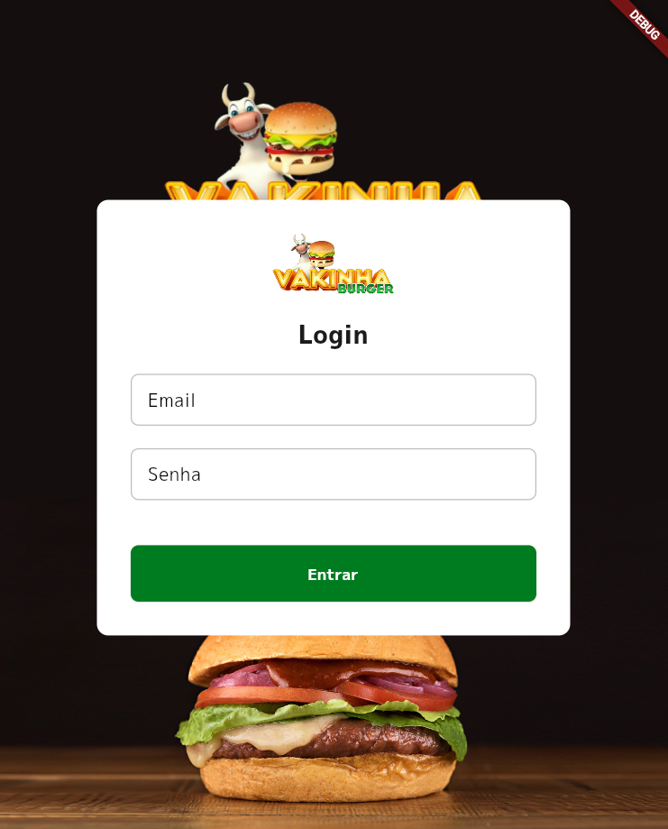
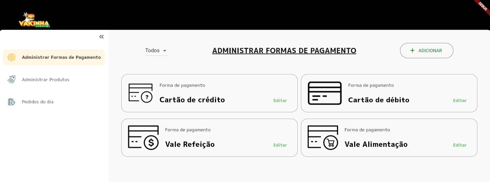
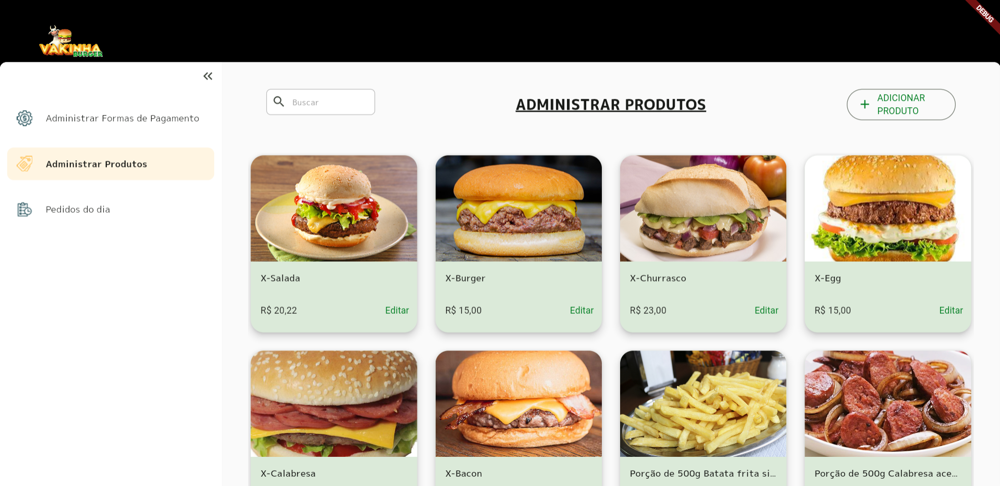
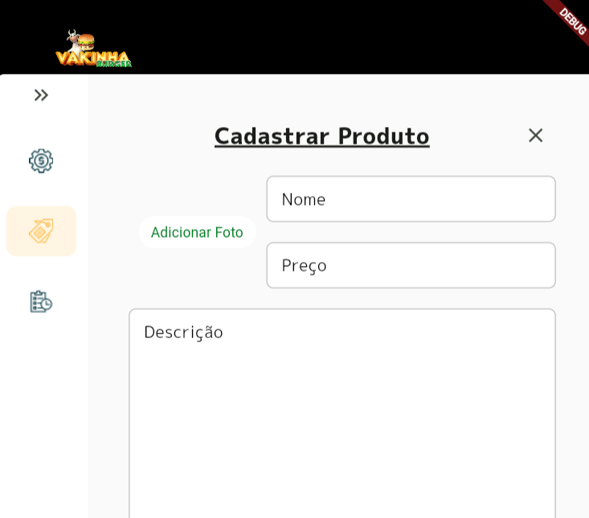
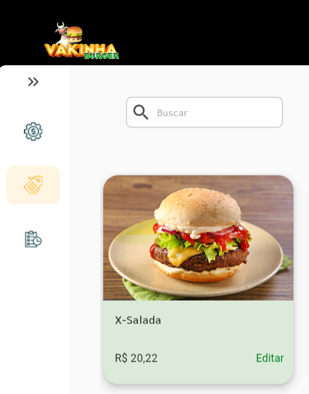
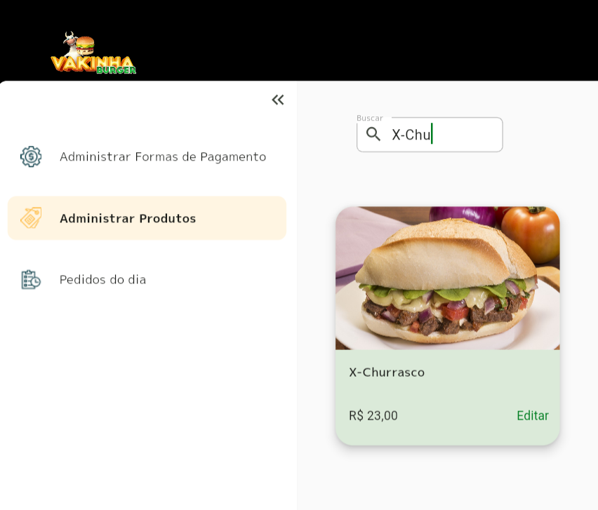
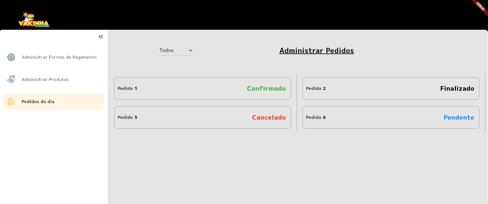
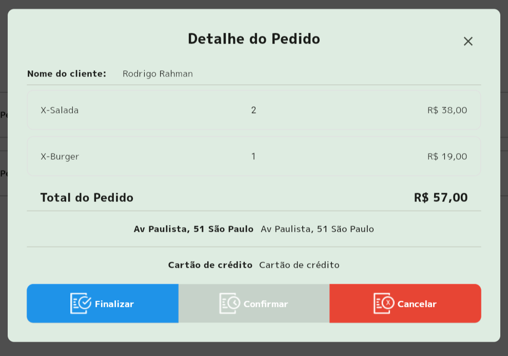

# Dart Week 10 com Rodrigo Rahman da Academia do flutter

## Semana de imersão em Dart com Rodrigo Rahman da Academia do Flutter

 

## Conteúdo aprendido:
### Back End: 
- json_rest_server
### Front End (Flutter WEB):
- Gerência de estado com MobX
- Rotas e injeção de dependências com Modular

 
 
 

# Dia 01:

## Links
- Figma: https://www.figma.com/file/fVcyjAmHwhrydVh98vJHT2/Vaquinha_adm_230402?type=design&node-id=117%3A506&t=dagnfikzUxwRv0BR-1
- Profile: https://vscode.dev/profile/github/019fb49d5fa901ccd010fe515cc05abc
- Postman: backend/postman.zip

## Baixando e configurando o backend

Back-End
repositório inicial: https://github.com/rodrigorahman/dw10_delivery_api.git

dart pub global activate json_rest_server

## Criando o projeto do front referente back office

Front-End:
Back Office:
flutter create --project-name delivery_backoffice_dw10 --org com.douglascarteribordignon --platforms web ./delivery_backoffice_dw10

## Acerto de Settings e analysis_options do projeto

Criar arquivo setings.json
{
    "dart.flutterHotReloadOnSave": "never"
    
}
Configurar Linnter em analysis_options

## Adicionar e configurar o flutter Modular e o Mobs no projeto

crtl + shift + p
e adicionar dependências, no dev o flutter_modular e mobx
no dev_dependences build_runner e mobx_codegen

mouse em cima de lib, botão esquerdo e Flutter Modular: Configure Framework 
(src)

## Criando estrutura de Enviroments do projeto

São variáveis de ambiente do nosso projeto
- Criar arquivo .env na raiz do projeto
dentro dele criar backend_base_url

Adicionar nova dependência flutter_dotenv

## Criar Helpers do projeto

### Loader
package interessante: loading_animation_widget
### Messages
package interessante: awesome_snackbar_content
### SizeExtensions
extension SizeExtensions on BuildContext {}

## Criando estilos, colors e text_styles do app
folder assets, app_styles, colors_app, text_styles

## Criar o tema do projeto
folder themes, theme_config

## Criando módulo e página de login
responsividade

## Implementação CustomDIO
Adicionar dio ao projeto
folder rest_client e custon_dio.dart

## Implementação Auth Data layer
Camada de repositório, emcapsulamento de Dio

## Implementação StorageClass
autenticação (explicação) que cria em local storage shared_preference 2.10
Vamos utilizar o session storage

## Implementação de Auth Service Layer

 

# Dia 02

## Implementando a tela de login
dart run build_runner watch -d
Validação: validatorless
start server
jrs run

## Implementando BaseLayout

### Template
Stack
Responsividade na altura da AppBar (não devemos colocar responsividade na altura da AppBar)
Criada uma estrutura de layout para imputar o corpo dentro

### MenuBar
Implementado utilizando em o enum
Animação em menubar ao aumentar ou reduzir

## Implementando base route com RouterOutlet
passada a RouterOutlet dentro de base layout

## PaymentTypePage
Modulo criado para ser passado dentro deRouterOutlet

## Implementando Interceptor Auth

### Interceptor
bug dentro de CustomDio auth() {

### Global Context
Contexto global pego e informado em app_widget.dart

## Payment Data Layer

 

# Dia 03

## Criando tela de pagamento
Trabalhando com GridView

### Base Header

## Implementando busca de pagamentos
controller

## Criar modal de criação e alteração de pagamentos
- Erro no modal, pois ao clicar fora não está fechando, pode ser algum erro do material 3

## Implementar o filtro de Pagamento
- Feito com DropdownButton

## Implementando tela de criação e alteração de pagamento
- variáveis locais tem auto promoção de tipo

## Produtos

 

# Dia 04

## Criando modulo e rotas home e detail de produto
- \ ou r 
- add brasil_fields

## Criando página de home de produto e Product Item

## Implementando Product Data Layer

## Implementando Salvar produto no data Layer

## Realizar a busca de produtos
- Debouncer

## Criação da tela de detalhe

## Implementação da tela de salvar 

## Criando tela de detalhe do produto

## Upload da imagem do produto

## Implementar tela de salvar produto

 

# Dia 05

## Implementar a tela de salvar produto

## Criação do módulo de pedido

## Criação da tela de pedido

## Implementando Order Data Layer

## Implementar a tela de lista de pedidos

## Criação da tela de detalhe do pedido

## Implementando User Data Layer

## Implementando Order Service Layer

## Buscar dados do pedido

## Apresentar os dados da tela de detalhe

## Implementando lógica de botões

## Implementando filtro de pedido

